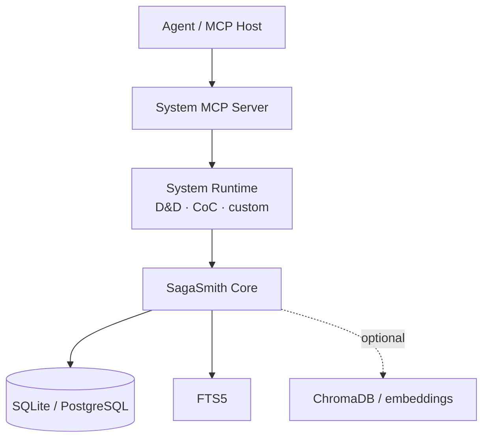

# SagaSmith Core

[中文](README.md) · [English](README-en.md) · [Platform overview](https://github.com/SagaSmithAI/.github/blob/main/profile/README.md)

**The system-neutral runtime for an AI-native TTRPG platform.** `sagasmith-core` gives rules systems, MCP servers, and clients persistent campaigns, actor knowledge, branching timelines, content ingestion, rule packs, and retrieval. It contains no D&D or Call of Cthulhu rules.

> World state should be verifiable, timelines should branch, and every actor should know only what they actually know.

## What it provides

- **Campaigns and characters** — system-neutral records, namespaced sheets, revisions, principals, and roles.
- **Branches and snapshots** — immutable snapshot DAGs, checkout, lineage, continuity, and integrity checks.
- **Actor knowledge** — facts scoped by actor, subject, branch, and visibility instead of one global summary.
- **Events and long-term memory** — event logs, stable fact identity, branch revisions, recaps, and continuity context.
- **Rule packs** — core/extension packages, profile locks, provenance, rule receipts, and mechanic IR.
- **Content ingestion** — resumable import jobs, content-addressed normalization/page caches, PDFium text extraction, selective OCR quality gates, and page-aware indexes.
- **Retrieval** — exact and lexical search, SQLite FTS5, plus optional ChromaDB and sentence-transformers.
- **System plugins** — D&D, CoC, and future systems register through the `sagasmith.systems` entry point.

## Where it sits



Core does not decide GM style, MCP exposure, or system-specific rules. Skills own operating guidance, system runtimes own rules, MCP servers own the capability/storage boundary, and Core owns consistent data semantics.

## Domain services

| Domain | Main services | Contract |
|---|---|---|
| Campaign | `CampaignService`, `AccessService` | system partitioning and principal/role boundaries |
| Character | `CharacterService`, `StateMutationService` | revisioned sheets and controlled mutation |
| Knowledge | `ActorKnowledgeService` | actor viewpoints and branch validity |
| Timeline | `SnapshotService`, `BranchService`, `ContinuityService` | ancestry, checkout, and continuity context |
| Content | `ImportJobService`, `ModuleService`, `PdfDocumentConverter` | resumable imports, provenance, structure, quality |
| Rules | `RulePackService`, `RuleProfileService`, `RuleReceiptService` | versioned packs, active context, settlement evidence |
| Retrieval | `RuleService`, `VectorStore` | graceful degradation; vectors never own truth |

## Install

Requires Python 3.11+:

```bash
pip install sagasmith-core
pip install "sagasmith-core[documents]"  # PDF
pip install "sagasmith-core[documents,ocr]"  # scanned/corrupt-text PDF recovery
pip install "sagasmith-core[vector]"     # ChromaDB
pip install "sagasmith-core[embedding]"  # sentence-transformers
pip install "sagasmith-core[all]"
```

```python
from sagasmith_core import CampaignService, Database, SystemRegistry

db = Database("sqlite:///sagasmith.db")
db.upgrade_schema()
systems = SystemRegistry.discover()
campaigns = CampaignService(db)
```

## Add a game system

Register a package through an entry point:

```toml
[project.entry-points."sagasmith.systems"]
my_system = "my_package.system:get_system"
```

The package supplies its profile, character schema, module parser, and rules engine. Keep Core tables system-neutral; use namespaced JSON or explicit extension tables for system-specific state.

## Integrity boundaries

- Snapshots, branches, and revisions are authoritative; vector hits are not.
- A snapshot is a self-contained full checkpoint; only its `recap` is a delta from the parent. Integrity covers the payload, DAG ancestry, and fact/event/actor-knowledge bindings.
- Objective facts use stable `fact_key` identities with branch-scoped revision heads and optimistic revision checks. Subjective actor knowledge remains a separate ledger.
- Prefer `ContinuityCommitService` at scene boundaries so the event, fact upserts, actor-knowledge changes, and optional snapshot commit as one transaction.
- Checkout never silently discards a dirty worktree; save a snapshot before switching branches.
- Writes should use expected revisions and idempotency keys so agent retries cannot duplicate effects.
- Player reads are limited to visible branches, scene scopes, and actor knowledge; GM authority requires an explicit principal/role.
- Parsed content retains provenance, pages, parser profile, and quality warnings; rich metadata is best effort.
- Document caches are checksum- and profile-bound. Corrupt cache entries are ignored, and
  parser-version changes can reuse verified PDF page extraction/OCR without accepting stale
  normalized structure.
- This is an Alpha project. Current migrations serve the current mainline schema and do not promise legacy database compatibility.

## Development

```bash
pip install -e ".[all,dev]"
pytest --cov
ruff check .
```

Further reading: [Architecture](docs/ARCHITECTURE.md) · [Quickstart](docs/QUICKSTART.md) · [Retrieval](docs/RETRIEVAL.md)

## License

MIT
