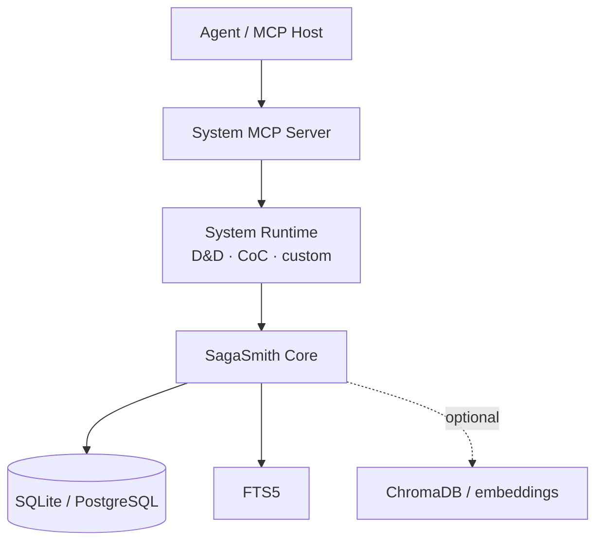

# SagaSmith Core

[中文](README.md) · [English](README-en.md) · [平台总览](https://github.com/SagaSmithAI/.github/blob/main/profile/README.md)

**AI 原生 TTRPG 平台的系统无关运行时。** `sagasmith-core` 为规则系统、MCP 服务和 UI 提供持久化战役、角色知识、分支时间线、内容导入、规则包与检索能力；它本身不包含 D&D 或 CoC 规则。

> 世界状态应当可验证，时间线应当可分支，每个角色只应知道自己真正知道的事。

## 它解决什么

普通聊天记忆无法充当长期战役数据库：它不知道哪条时间线有效，也无法可靠区分 GM、玩家、PC 和 NPC 的视角。SagaSmith Core 把这些问题建模为显式服务：

- **战役与角色** — system-neutral campaign/character 模型、namespaced sheet、revision 和访问控制。
- **分支与 Snapshot** — 不可变 Snapshot DAG、checkout、lineage、分支连续性和完整性校验。
- **Actor Knowledge** — 按 actor、主体、分支和可见范围维护所知事实，不把角色知识混入全局摘要。
- **事件与长期记忆** — 事件日志、事实身份、分支修订、continuity context 与 recap 数据面。
- **规则包** — core/extension 包、profile 锁定、版本与来源、规则 receipt 和机械 IR。
- **内容导入** — 可恢复 import job、内容寻址的标准化/页面缓存、PDFium 文本提取、选择性 OCR 质量门禁与页码索引。
- **检索** — 精确与词法检索、SQLite FTS5，以及可选的 ChromaDB + sentence-transformers。
- **插件系统** — 通过 `sagasmith.systems` entry point 注册 D&D、CoC 或新的系统实现。

## 架构位置



Core 不负责主持风格、MCP 工具暴露或具体规则裁决。Agent Skills 负责工作流，系统运行时负责规则，MCP 服务负责能力与存储边界，Core 负责一致的数据语义。

## 核心领域

| 领域 | 主要服务 | 关键保证 |
|---|---|---|
| Campaign | `CampaignService`, `AccessService` | system_id 分区、principal/role 访问边界 |
| Character | `CharacterService`, `StateMutationService` | revisioned sheet、受控状态写入 |
| Knowledge | `ActorKnowledgeService` | actor 视角隔离、分支有效性 |
| Timeline | `SnapshotService`, `BranchService`, `ContinuityService` | DAG 祖先链、checkout、连续性上下文 |
| Content | `ImportJobService`, `ModuleService`, `PdfDocumentConverter` | 可恢复导入、来源、结构与质量报告 |
| Rules | `RulePackService`, `RuleProfileService`, `RuleReceiptService` | 规则包版本、激活上下文和结算证据 |
| Retrieval | `RuleService`, `VectorStore` | 检索可降级，权威状态不交给向量库 |

## 安装

Python 3.11+：

```bash
pip install sagasmith-core
```

系统插件通常会自动安装 Core。按需启用 extras：

```bash
pip install "sagasmith-core[documents]"  # PDF
pip install "sagasmith-core[documents,ocr]"  # 扫描版或乱码 PDF 恢复
pip install "sagasmith-core[vector]"     # ChromaDB
pip install "sagasmith-core[embedding]"  # sentence-transformers
pip install "sagasmith-core[all]"
```

最小服务构造：

```python
from sagasmith_core import CampaignService, Database, SystemRegistry

db = Database("sqlite:///sagasmith.db")
db.upgrade_schema()
systems = SystemRegistry.discover()
campaigns = CampaignService(db)
```

## 扩展一个新规则系统

系统包通过 entry point 注册：

```toml
[project.entry-points."sagasmith.systems"]
my_system = "my_package.system:get_system"
```

系统实现提供 profile、角色 schema、模块解析与规则引擎；Core 表保持系统无关。需要新的系统字段时，优先使用 namespaced JSON 或系统包自己的明确扩展表，不向通用表塞入某一规则专属列。

## 稳定性与安全边界

- Snapshot、branch 和 revision 是权威连续性；向量命中不是。
- 客观事实使用稳定 `fact_key`，在分支内通过 revision head 演进；修订应携带
  `expected_revision_id`。角色的主观知识继续使用独立的 ActorKnowledge ledger。
- 场景收尾优先使用 `ContinuityCommitService`，在同一事务中写入事件、事实、
  角色认知和可选 Snapshot，避免产生半保存状态。
- Snapshot 在语义上是可独立恢复的全量 checkpoint；`recap` 才是相对父节点的差量摘要。完整性校验同时覆盖 payload、DAG 祖先链以及 fact/event/actor-knowledge bindings。
- checkout 不会静默丢弃工作区：当前分支有未保存变化时，必须先创建 Snapshot。
- 写操作应携带 expected revision 与幂等键，避免 Agent 重试造成重复副作用。
- 玩家读取只允许当前可见分支、场景作用域和角色知识；GM 权限需要显式 principal/role。
- 文档解析结果保留来源、页码、质量警告和 parser profile；调用方必须处理缺失的富元数据。
- 这是 Alpha 项目；主线迁移会保留当前已发布 schema 的数据，但不承诺任意旧实验版本或 downgrade 路径。

## 开发

```bash
pip install -e ".[all,dev]"
pytest --cov
ruff check .
```

更多资料：[Architecture](docs/ARCHITECTURE.md) · [Quickstart](docs/QUICKSTART.md) · [Retrieval](docs/RETRIEVAL.md)

## License

MIT
